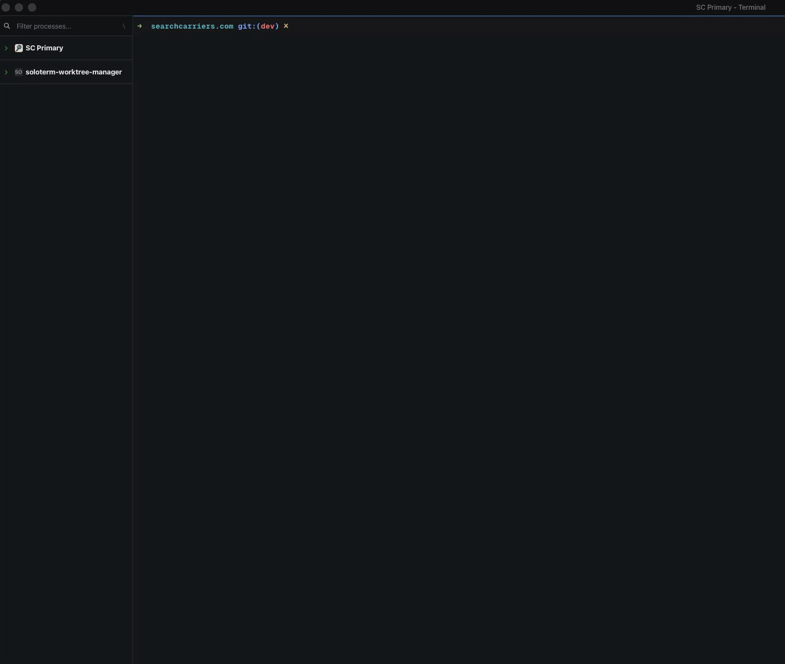

# Soloterm Worktree Manager

Create and manage Git worktrees that automatically sync to
[Solo](https://soloterm.com).



- 🌳 **A branch becomes a project** — one command creates the branch, the
  linked worktree, and the folder, all in a managed root.
- 🖥️ **Solo project, made for you** — every worktree is registered as its own
  Solo project, named `<repo>: <branch>`, ready for its own commands,
  terminals, and agents.
- 🌐 **Knows Laravel Herd** — parks the worktree root and serves each worktree
  at `http://<name>.test`, with no vhost to write.
- 🔐 **Brings your `.env`** — copies the ignored `.env` and rewrites `APP_NAME`
  and `APP_URL` to match the new site. Tracked or non-ignored files are refused.
- 🧠 **Remembers per project** — answer the `.env` question once and `swm`
  applies it to that repository from then on.
- 📥 **Adopts what already exists** — `swm add` registers any directory you
  already have with Solo, no branch created and nothing moved.
- 🧹 **Removes cleanly** — deletes the worktree and its Solo project, keeps the
  branch, and refuses to touch anything it did not create.
- 🐚 **Works with any shell** — bash, fish, nushell, zsh. `swm` brings its own
  interpreter, so your shell never has to change.
- 🩺 **Tells you what's wrong** — `swm health` checks every dependency and
  `swm health --fix` repairs what it safely can.
- ⬆️ **Updates itself** — `swm update`, plus a quiet check every couple of days.

## Requirements

Required:

- **Git**
- **Solo**, with its local HTTP API and `solo` CLI enabled

Optional:

- **[Laravel Herd](https://herd.laravel.com)** — when installed, `swm` parks
  the worktree root, derives the local TLD, and points `APP_URL` at the
  generated site. Without it, everything else works the same; only the local
  site URL is skipped.
- **`jq`** — used to parse Solo's JSON exactly. Without it `swm` reads the
  `solo` CLI's table output instead, which produces the same results.
- **`curl`** — needed by `swm update` and the periodic update check.

`swm` declares its own zsh interpreter, so the shell you use interactively is
irrelevant — bash, fish, nushell, and zsh all invoke it the same way, and none
of them need configuring. Run `swm health` to see exactly what is present on
your machine.

## Install

```sh
mkdir -p "$HOME/.local/bin"
curl -fsSL \
  https://raw.githubusercontent.com/adrenallen/soloterm-worktree-manager/main/swm \
  -o "$HOME/.local/bin/swm"
chmod +x "$HOME/.local/bin/swm"
```

Make sure `$HOME/.local/bin` is on your `PATH`, then run:

```sh
swm health
```

## Health check

```sh
swm health
swm health --fix
```

`swm health` reports every dependency, whether Solo's API is answering, where
the worktree root is, whether the installed script can update itself, and what
your terminal supports:

```
  ┏━┓╻ ╻┏┳┓
  ┗━┓┃╻┃┃┃┃  worktrees, tidied · 1.9.0
  ┗━┛┗┻┛╹ ╹

  REQUIRED
   ✓  zsh         5.9 /bin/zsh
   ✓  git         2.50.1 (Apple Git-155)
   ✓  solo        API ready (2 project(s))

  OPTIONAL
   ✓  jq          1.7.1-apple (parsing Solo's JSON)
   ✓  curl        available (swm update)
   ✓  herd        serving *.test from ~/Herd

  ENVIRONMENT
   ✓  worktrees   ~/Herd
   ✓  install     ~/.local/bin/swm (updatable)
   ✓  config      ~/.config/swm/projects.conf (1 remembered)
   ✓  terminal    xterm-ghostty (colour, unicode)

  ✓ Ready to use
```

Only the `REQUIRED` section affects the exit status, so `swm health` is usable
as a setup check in a script. `--fix` applies the repairs that cannot lose
anything — creating a missing worktree root, and installing `jq` through an
existing Homebrew — printing each command before it runs.

## Quick usage

Create a worktree from the current repository:

```sh
swm checkout-redesign dev
```

Copy the source `.env` and update `APP_NAME` (plus `APP_URL` under Herd):

```sh
swm checkout-redesign dev --with-env
```

Create one by answering questions instead of passing arguments:

```sh
swm new
```

Interactively create, fork, add, or remove worktrees:

```sh
swm
```

Answer `n` at the worktree prompt to create a new one, so plain `swm` covers
every operation without remembering any flags.

`swm manage` is the explicit equivalent. With no repository argument, manage
mode automatically uses the Git repository containing your current directory.

### Long names

The worktree name becomes the branch name as-is. The folder — and the Herd
hostname derived from it — is capped at the 63-character DNS label limit, so a
longer name is shortened for the folder rather than refused, and `swm` says so:

```
$ swm feature/Migrate-The-Entire-Billing-And-Invoicing-Subsystem-To-The-New-API dev
Folder name shortened to the 63-character DNS limit; the branch keeps its full name.

  ✓ Created and added to Solo

  Branch   feature/Migrate-The-Entire-Billing-And-Invoicing-Subsystem-To-The-New-API
  Path     ~/Herd/feature-migrate-the-entire-billing-and-invoicing-subsystem-to
  Folder   shortened to 63 chars (branch name is full)
```

`swm remove` shortens the same way, so removing by the full original name still
finds the worktree. Two names that differ only past the cut would share a
folder; that is refused rather than merged, and the error says why.

### Typos

Naming a branch to start from is what marks a create as deliberate, so a single
bare word is treated as a mistyped command rather than a new branch:

```
$ swm hlep
✗ Unknown command: hlep
  To create a worktree:  swm new
  Or name the branch:    swm hlep <branch-from>
  Every command:         swm help
```

## Adding an existing directory to Solo

```sh
swm add           # the current directory
swm add ~/Code/api
```

Registers the directory with Solo as a project without creating a branch,
copying a `.env`, or moving anything. Inside a Git checkout it resolves to the
worktree root, so it works from any subdirectory, and names the project
`<repo>: <branch>` — the same name worktree creation would have used. A
directory outside a repository is named after itself. Adding something that is
already a Solo project reports the existing project and changes nothing.

Useful for worktrees made with plain `git worktree add`, for a clone you want
in Solo as-is, or for one whose Solo project was deleted.

Manage mode does the same thing interactively. It lists every worktree in the
repository and whether each is already a Solo project:

```
  ┏━┓╻ ╻┏┳┓
  ┗━┓┃╻┃┃┃┃  worktrees, tidied · 1.9.0
  ┗━┛┗┻┛╹ ╹

  myapp · 3 worktree(s)

   #  BRANCH                        TYPE       SOLO  PATH
   1  main                          main       ✓     ~/Code/myapp
   2  billing-redesign              managed    ✓     ~/Herd/billing-redesign
   3  hotfix                        external   ✗     ~/scratch/hotfix

  ✗ 1 not in Solo — select one to add it

  Select [1-3, n=new, q]
```

Types are colour-coded (`main` magenta, `managed` green, `external` yellow) and
paths are shortened to `~`. Colour turns itself off when output is piped, when
`TERM` is `dumb`, or when `NO_COLOR` is set. On a terminal without a UTF-8
locale the ticks and box drawing become ASCII rather than mojibake.

Pick one showing `SOLO ✗` and choose `[a]dd to Solo`.

Removing works the same way in reverse. For a worktree under `SWM_ROOT`,
`[r]emove` deletes the directory and its Solo project. For a **main or external**
worktree it offers to remove the Solo project only:

```
This 'external' worktree is not under /Users/you/Herd,
so swm will not delete its directory or Git worktree.

  Remove its Solo project only? [y/N, files kept]
```

The directory, Git worktree, and branch are all kept — a worktree outside
`SWM_ROOT` is not `swm`'s to delete. Re-add it later with `swm add`.

## Remembering the .env choice

When you create or fork a worktree whose source has a `.env`, `swm` asks
whether to copy it, then offers to remember your answer for that project:

```
Copy .env and update it for the new worktree? [y/N]: y
Remember this for myapp from now on? [y/N]: y
```

Later runs on that project apply the remembered answer without asking. Clear it
to bring the prompt back:

```sh
swm forget
```

Defaults are keyed by the project's main worktree, so every linked worktree of
the same clone shares one setting, and `swm forget` works from inside any of
them. They are stored in `~/.config/swm/projects.conf`.

Both flags override a remembered default, and either one skips the prompt:

```sh
swm checkout-redesign dev --with-env   # always copy
swm checkout-redesign dev --no-env     # never copy
```

The question is only asked when stdin is a terminal, so a scripted or
cron-driven `swm` run never blocks waiting for an answer. Pass a flag
explicitly in those contexts rather than relying on saved state.

Remove a managed worktree while preserving its Git branch:

```sh
swm remove checkout-redesign
```

Worktrees default to `$HOME/Herd` when Herd is installed, and `$HOME/worktrees`
otherwise. Override the root with `SWM_ROOT=/another/path`.

## Updating

```sh
swm update
```

This downloads the latest `swm` and replaces the installed script in place.
The download is rejected unless it is a non-empty, syntactically valid `swm`
script with a version, so a truncated or redirected response cannot overwrite a
working install. The replacement is a same-directory rename, so updating while
`swm` is running is safe.

`swm update` refuses to overwrite a package-manager install, and refuses to
overwrite a Git checkout unless you pass `--force`.

`swm` also checks for a newer version every two days and prints a one-line
notice. The check runs in the background and reports from a cache, so it never
delays a command. Disable it with `SWM_NO_UPDATE_CHECK=1`.

```sh
swm version
```

## Environment

| Variable | Purpose |
| --- | --- |
| `SWM_ROOT` | Worktree root directory. |
| `XDG_CONFIG_HOME` | Location of `swm/projects.conf` (default `~/.config`). |
| `NO_COLOR` | Disable coloured output. |
| `SWM_NO_UPDATE_CHECK` | Set to `1` to disable the periodic update check. |
| `SWM_UPDATE_CHECK_INTERVAL` | Seconds between update checks (default `172800`). |

## Safety

Removal refuses directories not managed under `SWM_ROOT`. If a worktree has
uncommitted or untracked files, `swm` lets you show the file list, cancel, or
choose “delete anyway” with a typed-name confirmation. `--yes` never silently
authorizes deleting local changes. Environment copying requires `.env` to be
untracked and Git-ignored.

## License

[MIT](LICENSE)
